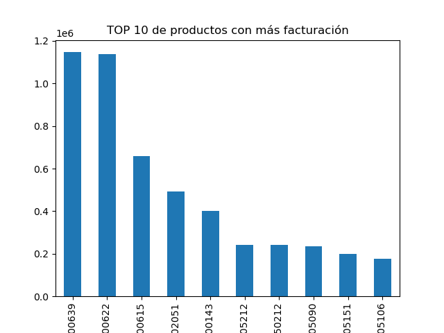

# EBAC Data Analytics Portfolio


## Overview

This repository documents my work throughout the **EBAC Data Analyst program**. It brings together class exercises, assignments, and an end-to-end sales analytics project covering the complete data workflow: data preparation, exploratory analysis, SQL, visualization, cloud processing, and time-series forecasting.

The repository demonstrates my ability to transform raw business data into clear, actionable insights using Python, SQL, AWS, and business-intelligence tools.

## Featured Project: Sales Analysis and Forecasting

The main project analyzes a consumer-products sales dataset composed of a fact table and dimension tables for products, categories, segments, and dates.

### Objectives

- Clean, validate, and integrate sales data from multiple sources.
- Analyze revenue by product, category, segment, region, and time.
- Identify the strongest commercial drivers and relevant sales patterns.
- Build visualizations and an interactive dashboard for decision-making.
- Forecast demand for the highest-selling product with a time-series model.

### Workflow

1. **Data preparation:** loaded CSV and Excel files, reviewed data types and missing values, and standardized the datasets.
2. **Data integration:** joined the sales fact table with product, category, segment, and calendar dimensions.
3. **Exploratory analysis:** evaluated sales distribution, market share, prices, volumes, outliers, and temporal behavior.
4. **SQL and cloud analysis:** worked with relational queries and cloud-based data-processing tools.
5. **Visualization:** created charts in Python and developed dashboard-ready analyses in Looker Studio.
6. **Forecasting:** trained and evaluated an **ARIMA(1,1,3)** model for the leading product.

### Key Findings

| Metric | Result |
|---|---:|
| Total sales analyzed | **$11,042,860** |
| Leading segment | **BLEACH** |
| BLEACH market share | **68.7%** |
| Leading region | **TOTAL AUTOS SCANNING MEXICO** |
| Leading region market share | **50%** |
| Top product | **CLORALEX EL RENDIDOR 3750 ML** |
| Top-product revenue | **$1,146,849.63** |
| Forecasted monthly demand | **Approximately 333 units** |

The analysis indicates a strong concentration of revenue in the BLEACH segment and in the TOTAL AUTOS SCANNING MEXICO region. Sales vary considerably across observations, suggesting that price, package size, promotions, and product mix may influence revenue in addition to volume. The ARIMA model did not identify a sustained trend or strong seasonality for the leading product; its longer-term forecast therefore converges toward approximately 333 units per month.

## Selected Visualizations
<!--
### Monthly Sales Trend


### Revenue by Segment


-->
### Top 10 Products



## Topics Covered

- Python programming and functional programming
- NumPy and Pandas for data manipulation
- Data cleaning and transformation
- Descriptive statistics and simulation
- Exploratory data analysis
- Data visualization with Matplotlib, Seaborn, and Plotly
- Relational databases and SQL
- NoSQL databases
- Regression, classification, and clustering
- Time-series analysis and forecasting
- Big-data processing and cloud computing
- Version control with Git and GitHub
- Dashboard development and business reporting

## Technologies

| Area | Tools and Libraries |
|---|---|
| Programming | Python, Jupyter Notebook |
| Data analysis | Pandas, NumPy, SciPy |
| Visualization | Matplotlib, Seaborn, Plotly, Looker Studio |
| Machine learning | Scikit-learn, Statsmodels |
| Databases | SQL, MySQL, NoSQL |
| Cloud and big data | AWS, Athena, Glue, S3, PySpark |
| Version control | Git, GitHub |

## Repository Structure

```text
EBAC/
├── Clases/       # Course examples and guided practice
├── Tareas/       # Module assignments and applied exercises
├── Proyecto/     # Capstone datasets, notebooks, and visualizations
└── README.md
```

The principal project files are located in [`Proyecto/`](Proyecto/). The folder includes the source datasets, exploratory notebooks, sales visualizations, SQL/Looker work, and the final forecasting notebook.

## How to Explore the Project

1. Clone the repository:

   ```bash
   git clone https://github.com/AI-YAZMIN-VILLEGAS/EBAC.git
   cd EBAC
   ```

2. Create and activate a virtual environment:

   ```bash
   python -m venv .venv
   source .venv/bin/activate
   ```

3. Install the main dependencies:

   ```bash
   pip install jupyter pandas numpy matplotlib seaborn plotly scipy scikit-learn statsmodels openpyxl
   ```

4. Start Jupyter Notebook:

   ```bash
   jupyter notebook
   ```

5. Open the notebooks in [`Proyecto/`](Proyecto/) to review the complete analysis.

> Some exercises use cloud services or database connections and may require separate credentials or configuration. Credentials are not included in this repository.

## Skills Demonstrated

- Translating business questions into analytical tasks
- Preparing and integrating multi-table datasets
- Writing reproducible analyses in Python and SQL
- Selecting clear visualizations for business metrics
- Identifying patterns, outliers, and commercial opportunities
- Evaluating forecasts with MAE, MSE, and MAPE
- Communicating technical results through concise business conclusions

## Author

**Yazmin Villegas**<br>
Industrial and Systems Engineer | Data Analyst | Data Scientist

[](https://github.com/AI-YAZMIN-VILLEGAS)

---

If you find this project useful, feel free to explore the notebooks and connect with me on GitHub.
